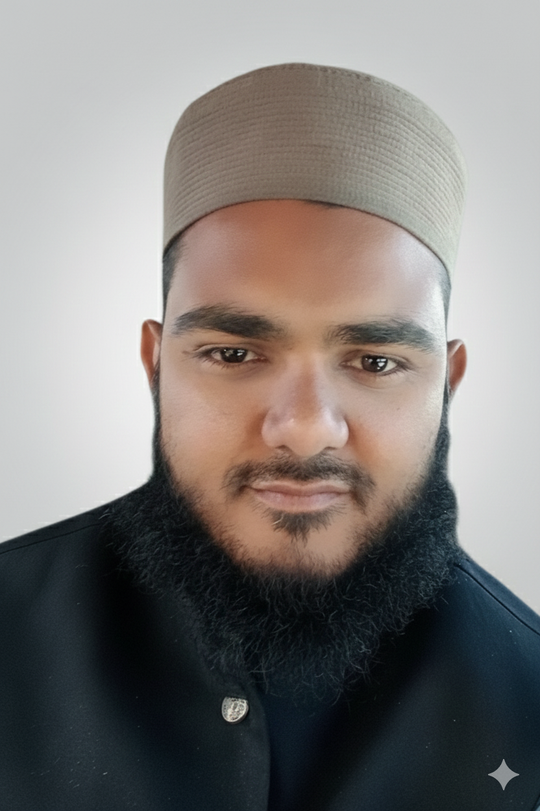

  <!-- Left Side: Name + Title -->

  <h1 style="font-size:2.2rem; font-weight:700; margin-bottom:5px; color:#00796b;">
    👨‍🔬 Muhammad Usman
  </h1>
  

    🌱 <b style="color:#009688;">Scientific Officer</b> (Learning AI in Plant Breeding & Genetics) | 
    📊 <b style="color:#009688;">Data Science Learner</b> | 
    🤖 <b style="color:#009688;">Researcher</b>
  

  

  <!-- Right Side: Profile Image -->
  

---

## 🌐 Explore My Work
🔗 **[My GitHub Portfolio](https://github.com/Usman9377)**

---

## 🤝 Connect With Me
- [💼 LinkedIn](https://www.linkedin.com/in/muhammad-usman-3b212919a/)  
- [💻 GitHub](https://github.com/Usman9377)  
- [📘 Facebook](https://web.facebook.com/?_rdc=1&_rdr#)  
- [📊 Kaggle](https://www.kaggle.com/ranamuhammmadusman)  
- [📺 YouTube](https://www.youtube.com/@PlantBreeder-9377)
- [📱 WhatsApp Channel](https://whatsapp.com/channel/0029Vb7JHUQDp2QAAWG7AC0b)
  <!-- Replace with your actual channel -->